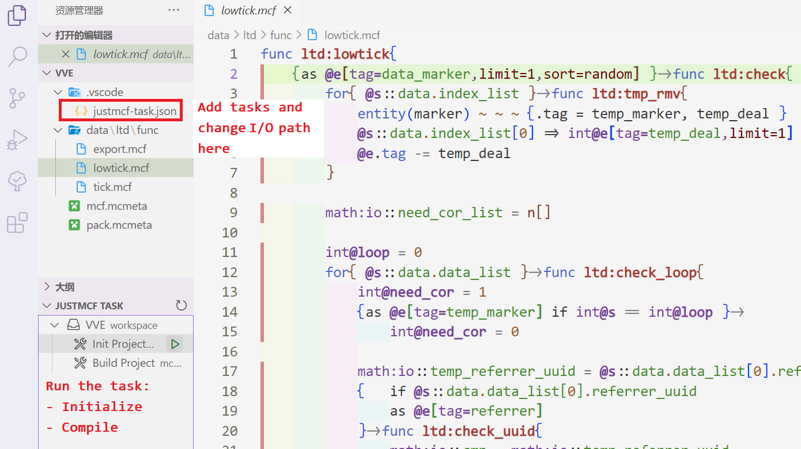

# vscode-just-mcf

Just MCF is a language framework aimed to simplify mcfuntion and provide language syntax sugar for datapack creators.

More information about Just MCF: [JustMCF](https://github.com/XiLaiTL/JustMCF)

## Features

- Initialize the Just MCF Project
- Highlight the code of .mcf
- Compile the Just MCF Project to Minecraft Java Edition Datapack

## Requirements

- [language-mcfunction](https://marketplace.visualstudio.com/items?itemName=arcensoth.language-mcfunction)

## Extension Settings

## Known Issues

## Release Notes

Users appreciate release notes as you update your extension.

### 0.0.1

Initial release
